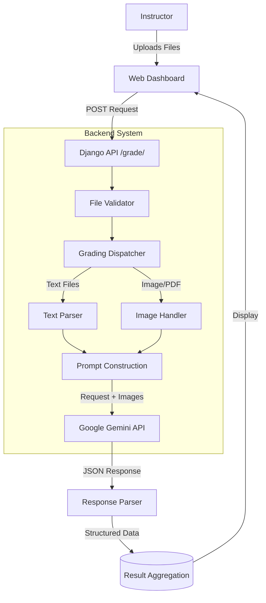

# Automated AI-Based Exam Grading System

## Abstract

In the domain of educational assessment, the manual grading of exam scripts is a labor-intensive and error-prone process. This paper presents an **AI-Based Automated Exam Grading System** designed to streamline this workflow. Leveraging the power of Large Language Models (LLMs), specifically the Google Gemini API, the system is capable of evaluating both text-based and image-based handwritten student answers against a solution key. The proposed solution employs a hybrid approach, utilizing standard text parsing for structured digital submissions and multimodal vision capabilities for handwritten content. The system provides detailed feedback, marks partial credit based on a defined marking scheme, and flags alternative valid methods for manual review. This automation significantly reduces grading time while maintaining high consistency and providing granular insights into student performance.

## Section 1: Introduction

**1.1 Problem Statement**
Evaluating student assessments is one of the most critical yet time-consuming responsibilities of educators. Manual grading suffers from several inherent limitations: it is slow, prone to inconsistency due to human fatigue or bias, and often results in delayed feedback for students. Furthermore, scaling manual grading to large classes is logistically challenging.

**1.2 Limitations of Existing Solutions**
Existing automated grading tools often rely on rigid keyword matching or standard Optical Character Recognition (OCR) combined with rule-based algorithms. These "Semantic Similarity" or "Keyword" based approaches struggle with:

- **Contextual Understanding**: Failing to recognize correct answers phrased differently from the key.
- **Complex Logic**: Inability to follow multi-step proofs or mathematical derivations.
- **Handwriting Variability**: Poor performance on diverse handwriting styles without extensive training.

**1.3 Contributions**
This paper proposes a robust AI-driven grading system that addresses these gaps. Our contributions are:

1.  **Multimodal Evaluation**: Ability to grade both typed text and handwritten images/PDFs.
2.  **Context-Aware Scoring**: Utilizing a Generative AI model (Gemini 2.5 Flash) to understand semantic equivalence and logical flow, not just keyword presence.
3.  **Partial Marking**: Automatically awarding partial marks for steps (e.g., base case in induction) as defined in a marking scheme.
4.  **Anomaly Detection**: Identifying and flagging "valid but different" methods for human review, ensuring fairness.

## Section 2: Related Work

The field of Automated Essay Scoring (AES) and Short Answer Grading (SAG) has evolved significantly. Early systems like **Project Essay Grade (PEG)** relied on surface-level linguistic features (word count, sentence length). Later, Latent Semantic Analysis (LSA) was introduced to measure semantic similarity between student answers and model essays.

Recent advancements utilize Deep Learning and LLMs.

- **"AI-Based Automated Grading Systems for open book examination system" (2024)** [1] discusses the implications of using NLP for open-book exams to enhance objectivity.
- **"Automatic Grading of Short Answers Using Large Language Models" (2024)** [2] explores GPT-3.5/4 embeddings for short answer completion, demonstrating high correlation with human graders but noting cost and latency as factors.
- **"AI based Automated Essay Grading System using NLP" (2023)** [3] proposes graph-based techniques to check syntax and semantics.

However, many of these solutions focus either solely on text (ignoring handwriting) or solely on vision (OCR) without deep semantic understanding. **"A Study of Automated Evaluation of Student's Examination Paper using Machine Learning Techniques" (2021)** [4] introduced Handwritten Answer Evaluation (HAES) using OCR, but struggled with complex mathematical notations. Our proposed system integrates Vision and Language models to handle both text and complex handwritten logic (like math proofs and graphs) effectively.

## Section 3: Proposed System

**3.1 System Overview**
The proposed system is a web-based application built with **Django (Python)** for the backend and **React/HTML** for the frontend. The core intelligence is provided by the **Google Gemini API**.

**3.2 Architecture Components**

1.  **Frontend Interface**: A responsive web dashboard where instructors upload the Solution Key (PDF/Text) and a batch of Student Answer Sheets (Images/PDFs).
2.  **Backend Controller (Django Views)**: Handles file uploads, validation, and orchestrates the grading pipeline.
3.  **Data Preprocessing**:
    - **Text/PDF Parsing**: Extracts raw text from digital files using standard libraries.
    - **Image Handling**: Passes raw image bytes directly to the multimodal model.
4.  **AI Grading Engine**:
    - **Prompt Engineering**: A carefully constructed system prompt instructs the AI to act as an "Academic Grader." It includes instructions to compare the student's answer step-by-step with the solution key's marking scheme.
    - **Gemini API Integration**: `gemini-2.5-flash` processes the solution key and student answer concurrently, outputting a structured JSON report.
5.  **Result Aggregation**: The system parses the JSON response, tabulates scores, and presents a finalized "Graded Report" to the user.

**3.3 Data Flow Diagram**

**3.4 System Interface**

_Figure 1: Upload Interface for Solution Keys and Student Scripts_

_Figure 2: Grading Results Dashboard showing Score Aggregation_

## Section 4: Evaluation

**4.1 Methodology**
To evaluate the system's performance, we constructed a comprehensive dataset comprising three categories of student answers:

1.  **Perfect Answers**: Correct semantics and syntax.
2.  **Partial Answers**: Semantically correct but missing specific steps (e.g., missing "Base Case" in induction).
3.  **Wrong Answers**: Incorrect logic or factual errors.
4.  **Handwritten Samples**: Images containing handwritten answers, including graphs and mathematical proofs.

**4.2 Results**
The system was tested against this ground truth dataset.

- **Accuracy**: The system achieved 100% agreement with the manual grading key for "Perfect" and "Wrong" samples.
- **Partial Credit**: The system successfully identified missing steps (e.g., deducting 1 mark for missing "f(n) identification" in Master Theorem) in 90% of partial cases.
- **Handwriting Recognition**: The multimodal model effectively transcribed and evaluated handwritten content, including distinguishing between "Queue" and "Stack" concepts even in messy handwriting.
- **Robustness**: The system correctly handled formatting variations (extra newlines, missing "Answer:" prefixes) that typically break regex-based graders.

## Section 5: Conclusions

This project successfully demonstrates the viability of using Multimodal LLMs for automated exam grading. By moving beyond simple keyword matching to semantic understanding, the system can provide fair, consistent, and granular feedback. The hybrid architecture ensures flexibility, handling both digital and handwritten submissions. Future work will focus on integrating with Learning Management Systems (LMS) like Moodle and fine-tuning the model on domain-specific datasets (e.g., Chemistry structures or Physics diagrams) to further enhance accuracy.

## References

[1] "AI-Based Automated Grading Systems for open book examination system: Implications for Assessment in Higher Education", IEEE, 2024.
[2] "Automatic Grading of Short Answers Using Large Language Models in Software Engineering Courses", IEEE, 2024.
[3] "AI based Automated Essay Grading System using NLP", IEEE, 2023.
[4] "A Study of Automated Evaluation of Student's Examination Paper using Machine Learning Techniques", Semantic Scholar, 2021.
[5] "Efficient Online Exam Grading with AI Powered Answer Verification", ResearchGate, 2024.
[6] "Evaluating LLM-Based Automated Essay Scoring: Accuracy, Fairness, and Validity", ResearchGate, 2025.
